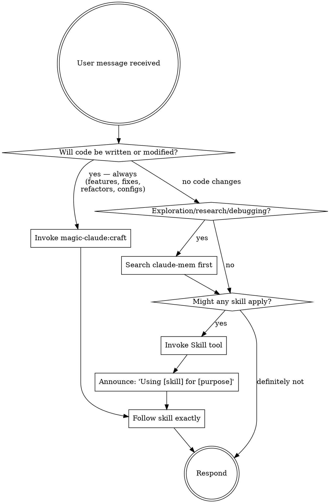

## Disposition: Quality Over Speed

Breathe. Take your time. The user values context, quality, and process adherence over fast delivery. Rushing through steps or collapsing phases to "ship faster" is not helpful -- it produces worse outcomes. Following the full pipeline IS the fastest path to correct results.

**Violating the letter of the rules is violating the spirit of the rules.**

Context, quality, and process over speed. The user will thank you.

## The Rule

**Check for applicable skills BEFORE any response or action.** Even a small chance a skill applies means you should invoke it. If an invoked skill turns out to be wrong for the situation, you don't need to follow it.

```dot
digraph skill_flow {
    "User message received" [shape=doublecircle];
    "Will code be written or modified?" [shape=diamond];
    "Invoke magic-claude:craft" [shape=box];
    "Exploration/research/debugging?" [shape=diamond];
    "Search claude-mem first" [shape=box];
    "Might any skill apply?" [shape=diamond];
    "Invoke Skill tool" [shape=box];
    "Announce: 'Using [skill] for [purpose]'" [shape=box];
    "Follow skill exactly" [shape=box];
    "Respond" [shape=doublecircle];

    "User message received" -> "Will code be written or modified?";
    "Will code be written or modified?" -> "Invoke magic-claude:craft" [label="yes — always\n(features, fixes,\nrefactors, configs)"];
    "Will code be written or modified?" -> "Exploration/research/debugging?" [label="no code changes"];
    "Exploration/research/debugging?" -> "Search claude-mem first" [label="yes"];
    "Exploration/research/debugging?" -> "Might any skill apply?" [label="no"];
    "Search claude-mem first" -> "Might any skill apply?";
    "Invoke magic-claude:craft" -> "Follow skill exactly";
    "Might any skill apply?" -> "Invoke Skill tool" [label="yes"];
    "Might any skill apply?" -> "Respond" [label="definitely not"];
    "Invoke Skill tool" -> "Announce: 'Using [skill] for [purpose]'";
    "Announce: 'Using [skill] for [purpose]'" -> "Follow skill exactly";
    "Follow skill exactly" -> "Respond";
}
```

## claude-mem Before Exploration (MANDATORY)

When claude-mem is installed, **MUST search claude-mem BEFORE** using Explore agents, reading code for architectural understanding, or investigating bugs. Past sessions likely contain decisions, patterns, and resolutions that eliminate redundant exploration.

**Triggers** — any of these intents require a claude-mem search first:
- "How does X work?" / "Why was X built this way?"
- Debugging or investigating unexpected behavior
- Planning changes to existing systems
- Reviewing code you haven't seen before
- Any task where the Explore agent would be spawned

**What to search for:** the component, feature, error, or concept name. One `search()` call (~50-100 tokens per result) is cheap — skipping it wastes far more tokens re-exploring.

**Skip claude-mem when:** writing brand-new code with no history, working on a fresh project, or claude-mem is not installed.

## Code Changes (MANDATORY — No Exceptions)

**ANY code modification** — features, bug fixes, refactors, config changes — MUST go through `magic-claude:craft`:

1. **NEVER** use EnterPlanMode when code will change — invoke `magic-claude:craft` instead
2. Craft starts with **Quick Discover** (Phase 1.1) — a lightweight impact scan that determines LITE vs FULL mode based on actual fan-out analysis. You do NOT decide the mode — Quick Discover decides.
3. FULL mode orchestrates: QUICK DISCOVER -> TASK LIST -> DEEP DISCOVER -> PLAN <-> PLAN CRITIC (auto-loop, max 3 cycles) -> [UI DESIGN] -> TDD (per-task with spec review) -> VERIFY -> REVIEW+HARDEN -> SIMPLIFY -> DELIVER -> REPORT
4. LITE mode orchestrates: QUICK DISCOVER -> TASK LIST -> TDD -> VERIFY -> REVIEW -> REPORT
5. EnterPlanMode is ONLY for pure research/exploration or explicit `magic-claude:plan` commands
6. The ONLY exceptions that skip craft: documentation-only changes (README, JSDoc) and pure config with no behavioral impact (tsconfig formatting)

## Craft Pipeline Recovery (After Compaction or /clear)

This meta-skill survives compaction and `/clear` because SessionStart re-injects it. Use this to recover an in-progress craft pipeline.

**On every session start, resume, compaction, or /clear — check:**

1. Does `.claude/craft/craft-state.md` exist?
   1a. If not found, also check legacy locations: `.claude/craft-state.md` or `.claude/orchestration-state.md` (from older plugin versions)
2. If YES: read it. It contains the feature name, current phase, plan path, Resume Directive, and key decisions.
3. Read the plan from the path recorded in the state file (e.g., `.claude/plans/YYYY-MM-DD-feature.md`).
4. **Follow the Resume Directive** — it contains the exact next action, remaining phases, and instruction to invoke `magic-claude:craft`.
5. **Determine recovery mode:**
   - **Auto-resume (compaction):** If your compressed context mentions the same feature or craft pipeline work — you were just working on this. **Do NOT ask the user.** Re-read the craft skill (`magic-claude:craft`), restore phase context from the state file, and **continue from the recorded phase immediately.** The user expects you to keep going.
   - **Ask user (new session or /clear):** If your context has NO memory of this feature — this is a crash or fresh start. Ask: *"Found incomplete craft pipeline for **<feature>** at Phase <N>. Resume or start fresh?"*

**If NO state file exists:** no recovery needed, proceed normally.

**CRITICAL:** After compaction, the #1 failure mode is stopping to ask the user instead of continuing. If in doubt, auto-resume — the user can always redirect you.

## Red Flags

These thoughts mean STOP -- you're rationalizing skipping a skill or workflow step:

| Thought | Reality |
|---------|---------|
| "This is too simple for craft" | Quick Discover takes 30 seconds. Let it decide, not you. |
| "It's just a one-line fix" | One-line fixes break untested callers. Quick Discover catches that. |
| "I can skip the tests just this once" | No production code without a failing test first. |
| "Let me just write the code quickly" | Speed is not the goal. Quality is the goal. |
| "I'll come back and add tests later" | You won't. Write them first. |
| "The user wants this fast" | The user wants this RIGHT. |
| "I already know what to do" | Check for skills anyway. They evolve. |
| "This doesn't need a formal plan" | You don't decide — Quick Discover decides LITE vs FULL. |
| "This is obviously FULL/LITE, skip the scan" | The scan produces data, not just a mode. Write the Impact Brief to the state file. |
| "I'll skip the review, the code is fine" | You wrote it -- you can't objectively review it. |
| "Let me explore first, then check skills" | Skills tell you HOW to explore. Check first. |
| "This doesn't count as a feature" | If it changes behavior, it goes through craft. |
| "I'll just update the docs too while I'm here" | Docs updates after code changes ARE part of craft. |
| "I don't need a task list for this" | The task list IS compaction insurance. Skip it = lose everything on compact. |
| "I'll create tasks as I go" | No. Create ALL tasks upfront. That's the contract. |
| "I can track the phases mentally" | You can't — compaction erases your memory. The task list survives. |
| "I'll just do the review/discovery myself" | You wrote the code — you can't review it objectively. Dispatch the agent. |
| "Dispatching an agent is overkill here" | The agent brings fresh context without your implementation bias. That's the point. |
| "The plan is obvious, no need to ask the user" | Plan approval is mandatory. The user validates the approach. Check CRAFT_AUTO_APPROVE_PLAN env var. |
| "I'll clean up the state/plan files" | NEVER delete them. Move state to .claude/plans/ on completion. They're permanent audit artifacts. |
| "One review pass is enough, it's clean" | Write the loop exit reason in the state file. Prove WHY cycle 1 was sufficient. |

## Verification Before Completion

**No completion claims without fresh verification evidence in this message.**

Claiming work is complete without running the verification command is dishonesty, not efficiency.

### The Gate

Before ANY status claim, completion statement, or expression of satisfaction:

1. **IDENTIFY** — What command proves this claim? (test suite, build, linter, type check)
2. **RUN** — Execute it. Fresh. Complete. In this message.
3. **READ** — Full output. Check exit code. Count failures.
4. **CLAIM** — State the result WITH evidence. If it fails, say so.

Skip any step = the claim is unverified.

### Banned Language (Without Evidence)

These words are **forbidden** unless you ran the command and saw the output:

- "should work", "should pass", "should be fine"
- "probably works", "likely passes"
- "looks correct", "seems right"
- "I'm confident this works"
- "Done!", "Perfect!", "All good!"

### What Each Claim Requires

| Claim | Must Run | NOT Sufficient |
|-------|----------|----------------|
| "Tests pass" | Test command output showing 0 failures | Previous run, "should pass", code looks right |
| "Build succeeds" | Build command with exit 0 | Linter passing, tests passing |
| "Lint clean" | Linter output with 0 errors | Build passing, partial check |
| "Bug fixed" | Test reproducing the original symptom passes | Code changed, assumed fixed |
| "Types check" | Type checker output with 0 errors | Linter passing, code compiles |

### Applies EVERYWHERE

This is not just for the orchestration pipeline. It applies to:
- Simple bug fixes
- One-off changes
- Agent delegation results (verify independently, don't trust reports)
- Any message where you're about to say something is done

## Learned Skills

Learned skills capture project-specific patterns, error resolutions, and workarounds from past sessions. They follow the standard skill directory pattern (`<name>/SKILL.md`) and are registered in the Skill tool:

- **Project-level:** `.claude/skills/<name>/SKILL.md`
- **User-level:** `$CLAUDE_CONFIG_DIR/skills/<name>/SKILL.md` (resolve via `CLAUDE_CONFIG_DIR` env var; defaults to `~/.claude`)

When the SessionStart injection lists learned skills below, **check if any apply to your current task**. Invoke relevant ones via the `Skill` tool -- never use Read on skill files.

## Skill Types

**Rigid** (orchestration, TDD, review, verification): Follow exactly. Do not adapt away discipline.

**Flexible** (patterns, standards, backend-patterns): Adapt principles to context.

The skill itself tells you which type it is.

## User Instructions

User instructions say WHAT to build, not HOW to build it. "Add X" or "Fix Y" does not mean skip the planning, testing, or review workflows.
