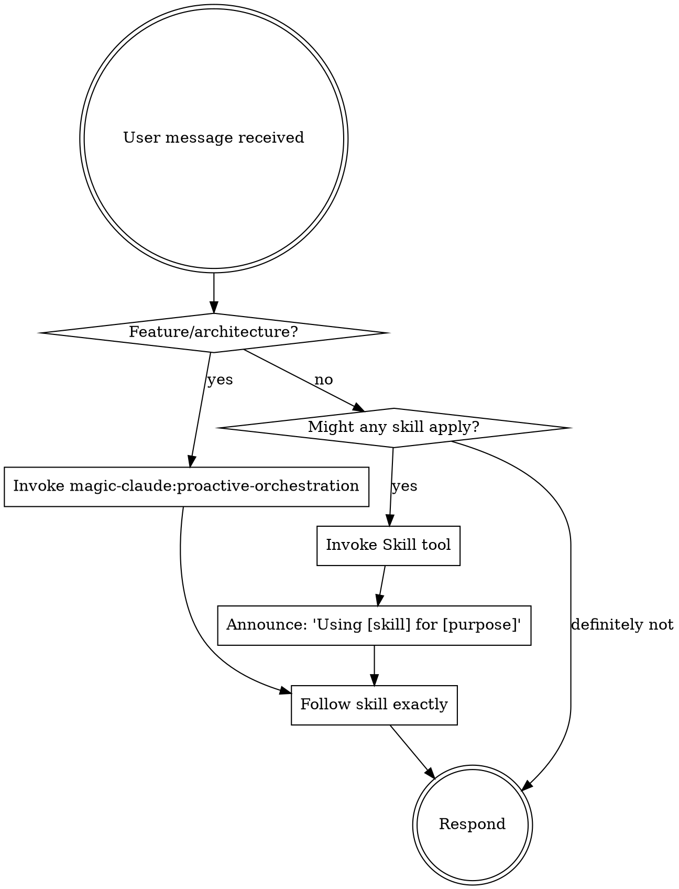

## Disposition: Quality Over Speed

Breathe. Take your time. The user values context, quality, and process adherence over fast delivery. Rushing through steps or collapsing phases to "ship faster" is not helpful -- it produces worse outcomes. Following the full pipeline IS the fastest path to correct results.

**Violating the letter of the rules is violating the spirit of the rules.**

Context, quality, and process over speed. The user will thank you.

## The Rule

**Check for applicable skills BEFORE any response or action.** Even a small chance a skill applies means you should invoke it. If an invoked skill turns out to be wrong for the situation, you don't need to follow it.

## Feature Implementation (MANDATORY)

For feature requests that involve writing code:

1. **NEVER** use EnterPlanMode -- invoke `magic-claude:proactive-orchestration` instead
2. The orchestrator coordinates: PLAN -> TDD -> VERIFY -> REVIEW in sequence
3. EnterPlanMode is ONLY for pure research/exploration or explicit `magic-claude:plan` commands
4. Simple bug fixes, single-file edits, documentation, and refactoring do NOT need orchestration

## Red Flags

These thoughts mean STOP -- you're rationalizing skipping a skill or workflow step:

| Thought | Reality |
|---------|---------|
| "This is too simple for the full pipeline" | If it touches multiple files, use the pipeline. |
| "I can skip the tests just this once" | No production code without a failing test first. |
| "Let me just write the code quickly" | Speed is not the goal. Quality is the goal. |
| "I'll come back and add tests later" | You won't. Write them first. |
| "The user wants this fast" | The user wants this RIGHT. |
| "I already know what to do" | Check for skills anyway. They evolve. |
| "This doesn't need a formal plan" | If it spans multiple files, it needs a plan. |
| "I'll skip the review, the code is fine" | You wrote it -- you can't objectively review it. |
| "Let me explore first, then check skills" | Skills tell you HOW to explore. Check first. |
| "This doesn't count as a feature" | If it changes behavior, it's a feature. |

## Learned Skills

Learned skills capture project-specific patterns, error resolutions, and workarounds from past sessions. They are available at:

- **Project-level:** `.claude/skills/learned/`
- **User-level:** `~/.claude/skills/learned/`

When the SessionStart injection lists learned skills below, **check if any apply to your current task**. Invoke relevant ones via the `Skill` tool -- never use Read on skill files.

## Skill Types

**Rigid** (orchestration, TDD, review, verification): Follow exactly. Do not adapt away discipline.

**Flexible** (patterns, standards, backend-patterns): Adapt principles to context.

The skill itself tells you which type it is.

## User Instructions

User instructions say WHAT to build, not HOW to build it. "Add X" or "Fix Y" does not mean skip the planning, testing, or review workflows.
